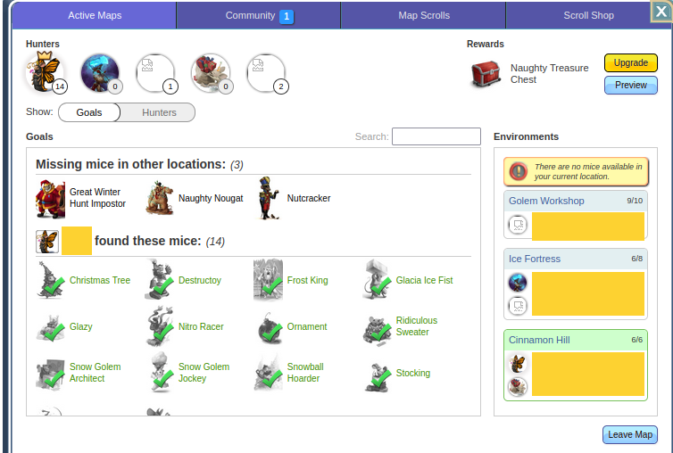

# 0002 - Mapping

Most treasure maps cannot be traded normally, like an item (except for any
gilded scroll case). For the ones that can, please check [Items](../Items). Instead, a user would have to open a map scroll, then invite whoever they would like to invite into the map, or if a user wants to join a map, then they would have to request an invite.

## Map instances

GNAWEX must have a record of all treasure maps, which we may refer to as such.
If a user opens it, then it's an **instance** of the treasure map, or a treasure
map instance. The instance must contain all the relevant details needed to
distinguish it from other instances.

<figure markdown>
  
  <figcaption>An opened map scroll with 5 out of 5 user slots filled. This is a map instance.</figcaption>
</figure>

!!! note

    Ideally, GNAWEX must automatically verify if the map even exists, and if the
    user creating the listing for it truly is the current maptain. But this might
    not be possible because of the restrictions around MH's API. Up for discussion.

An instance's MH map ID must be unique. One can get their MH map ID under Active Maps -> Map they want to check -> Hunters -> Share. It looks something like this: https://www.mousehuntgame.com/tm.php?map_id=000000 wherein the sequence of 0s is the MH map ID.

So, an instance must have the ff details:

ID | Map Record ID | MH Map ID | Delisted
-- | -- | -- | --
The GNAWEX instance ID | The ID of a GNAWEX map record | Map ID of the instance in MouseHunt | `true` \| `false`

Once delisted, they must not be able to reverse this action.

### Restrictions

There are two types of maps: an event map, and a normal map. Since a user may
have one active instance per type, the restriction follows as well. A user must
only have at most two map instances, if one of it is a normal instance, and the
other is an event instance. They must not be able to have more than one active
normal instance, for example.

If the user wishes to create another instance, they must delist their
active instance first.

## Instance roles

In an instance, the maptain must specify what role(s) they would like to invite.
The number of roles that they may invite depends on the number of available
slots that the map has.

These roles that the maptain may look for have specific duties to fulfill
(the who invites). Others may also look for maps that have these roles available
for invite (the joiner). The roles are best described by Aardwolf's
[mapping 103 guide](https://discord.com/channels/275500976662773761/1008902458313019484/1009446840913121351).
In short: a user may invite in at least one role, or join as only one role.

These are the supported roles that may be invited to an instance:

Role name | Description | Permanent slot | Slots consumed | Keeps chest contents | Pays to current Maptain for slot
--- | --- | --- | --- | --- | ---
Maptain | Map captain. Buying this role means you're buying the entire map. | Yes | All | Yes | Yes
Helper | Helps complete the map | Yes | 1 | Yes | No
Sniper/Looter | Clears off mice/items from the treasure map. Does not include LM/LL. | No | None | No | No, gets paid by maptain.
Leecher | Doesn't help with the map | Yes | 1 | Yes | Yes
Duster | Like leecher but dusts map with RMD | Yes | 1 | Yes | Less to none. May get paid.
Closer | Like leecher but catches LM/LL | Yes | 1 | Yes | Discounted

## Role listings

A role listing describes a user's intent to invite others to/participate in a
map instance. Hence, these can be categorized into two types: an invite listing,
and a join request listing.

Depending on the role, certain columns may be set; for others, maybe not. But
here's what all role listings must have recorded:

Listing ID | Role | Type
-- | -- | --
Role listing ID | Any supported role | `INVITE` or `JOIN`

### Roles, in-depth

#### Maptain

Giving away a maptain role means that you're going to give the entirety of an
already-opened map. A user must not be able to sell a maptain alongside other
roles because there are no other slots/roles that can be added. A user also must
not be able to pick the maptain role to both invite/join for scroll cases that
can be traded. But their dusted counterparts are eligible.

Listing ID | Instance ID | Role | Type | Cost
-- | -- | -- | -- | --
Role listing ID | ID of the map instance in GNAWEX | `MAPTAIN` | `INVITE` | If `INVITE`, current maptain is asking for this much for the other maptain to take over. If `JOIN`, user who wants to become the new maptain would pay the current one this much.

!!! note

    The old and new maptain must mark the transaction as complete as soon as the
    old maptain invites the new one, AND \[the old maptain\] leaves the map.

#### Sniper/Looter

Sniper/looter roles are considered temporary roles in a map instance because
they do not stick around when it's complete (for the map chest). GNAWEX must
also keep a record of all possible mice for the snipers and maptains to select.

For the maptain:

Listing ID | Instance ID | Role | Type | Cost | Mouse ID
-- | -- | -- | -- | -- | --
Role listing ID | ID of the map instance in GNAWEX  | `SNIPER` | `INVITE` | Amount for the maptain to pay for service | Mouse to snipe

For the sniper:

Listing ID | Role | Type | Cost | Mouse ID
-- | -- | -- | -- | --
Role listing ID | `SNIPER` | `JOIN` | Amount the sniper wants to be paid by the maptain for their service | Mouse to snipe

The sniper must not need to specify the instance, nor the map because all
they're concerned with is dealing with the mouse/loot, nothing else.

Here's what the flow looks like:

1. Maptain creates an invite listing with one available role: a sniper role and
chooses the mouse/item to snipe/loot
2. Match happens
3. Sniper/looter clicks link and requests to join
4. Maptain accepts invite
5. Sniper/looter does their job & leaves
6. Maptain and sniper/looter mark the transaction as complete
7. GNAWEX frees up one extra role for the instance

With this, the maptain may look for a new role to invite.

!!! note

    The maptain and sniper/looter must both mark the transaction as `COMPLETE`
    when as soon as the sniper/looter completes their job and gets paid.

#### Helpers

Since helpers are expected help out with the map, no payment is involved.

For the maptain:

Listing ID | Instance ID | Role | Type
-- | -- | -- | --
Role listing ID | ID of the map instance in GNAWEX | `HELPER` | `INVITE`

For the helper:

Listing ID | Map ID | Role | Type
-- | -- | -- | --
Role listing ID | ID of the map record in GNAWEX | `HELPER` | `JOIN`

The helper must specify what kind of map they would like to help out with, but
must not need to specify a particular instance because the matching is done by
GNAWEX.

#### Leechers

Leechers are not expected to help out with the map, and they need to pay the
maptain to join.

For the maptain:

Listing ID | Instance ID | Role | Type | Cost
-- | -- | -- | -- | --
Role listing ID | ID of the map instance in GNAWEX | `LEECHER` | `INVITE` | Amount the maptain will charge the leecher

For the leecher:

Listing ID | Map ID | Role | Type | Cost
-- | -- | -- | -- | --
Role listing ID | ID of the map record in GNAWEX | `LEECHER` | `JOIN` | Amount the leecher will pay the maptain to join

#### Dusters

Dusters are like leechers, but must dust the map. So they either get charged
much less, or even get paid. If the maptain will pay the duster, then they must
not set how much they \[the maptain\] will get paid.

For the maptain:

Listing ID | Instance ID | Role | Type | Cost for duster to get paid | Cost for maptain to get paid
-- | -- | -- | -- | -- | --
Role listing ID | ID of the map instance in GNAWEX | `DUSTER` | `INVITE` | How much duster will earn | How much maptain will earn

For the leecher:

Listing ID | Map ID | Role | Type | Cost for duster to get paid | Cost for maptain to get paid
-- | -- | -- | -- | -- | --
Role listing ID | ID of the map record in GNAWEX | `DUSTER` | `JOIN` | How much duster will earn | How much maptain will earn

#### Closers

Closers are like leechers. Except they must get the LM/LL, and they must pay
the maptain to join. But a discount is usually provided.

For the maptain:

Listing ID | Instance ID | Role | Type | Cost
-- | -- | -- | -- | --
Role listing ID | ID of the map instance in GNAWEX | `CLOSER` | `INVITE` | Amount the maptain will charge

For the closer:

Listing ID | Map ID | Role | Type | Cost
-- | -- | -- | -- | --
Role listing ID | ID of the map record in GNAWEX | `CLOSER` | `JOIN` | Amount the closer will pay the maptain to join

!!! note

    When the map is closed/complete for the helpers/leechers/dusters/closers,
    all parties involved must mark the transaction as `COMPLETED`.

### Role restrictions

Here are the current role restrictions:

Role name | Min. number | Max number
--- | --- | ---
Maptain | 0 | 1 (blocks current maptain from inviting other roles)
Helper | 0 | Max slots - 1
Sniper/looter | 0 | Max slots - 1
Duster | 0 | 1
Leecher | 0 | Max slots - 1
Closer | 0 | 1

!!! info

    While the minimums are 0, the listing **must** have one role per slot to be
    sold.

### Create a join request listing

A user may create a join request listing but must only be allowed to pick
**one** role to join as. If they want to be two roles for the same kind of map
(e.g Nice List), then they must create two join request listings. If their
listing gets matched with another, all of their other join request listings
will be temporarily delisted until the transaction is complete.

They may also choose their preferred LM, or select a group of mice that they
would like to have as the LM. If they do not choose a LM, then this means
anything goes.

### Create an invite listing

!!! warning inline end

    You **must** be the current maptain to be able to create an invite listing.

An invite listing means the maptain is looking to invite others to the map to
fulfill a single role. A maptain may have multiple role invite listnings if they
need to look for multiple roles.

### Updating a listing

A role listing may be updated but restrictions apply. Generally speaking, a
listing must not be updated if it has already concluded.

#### Invite listing

A maptain may add new roles, or remove unfilled roles. They must not remove
roles that are involved in a `PENDING` or `COMPLETED` transaction.

### Concluding a listing

A role listing must be considered concluded if it was `CANCELLED`, or
`COMPLETED`.

## Transactions

### Status

- `PENDING` - If the joiner is still fulfilling their duties/waiting for the map to complete/close. This must 'hold' the role.
- `COMPLETED` - When the joiner has fulfilled their duties/the map is completed. This must 'indefinitely' hold the role.
- `CANCELLED` - If both the maptain and the joiner are in mutual agreement, and decide to back off of their deal. Both need to mark it as `CANCELLED` otherwise it will not be marked as such. Cancelling must release the role back.

## FAQ

WIP
