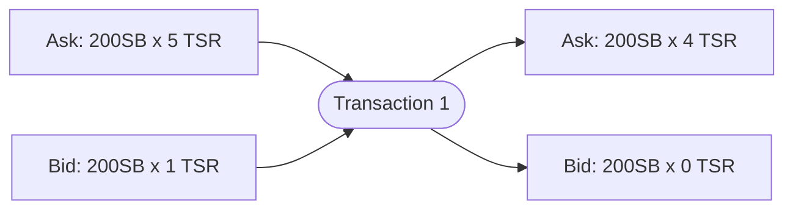
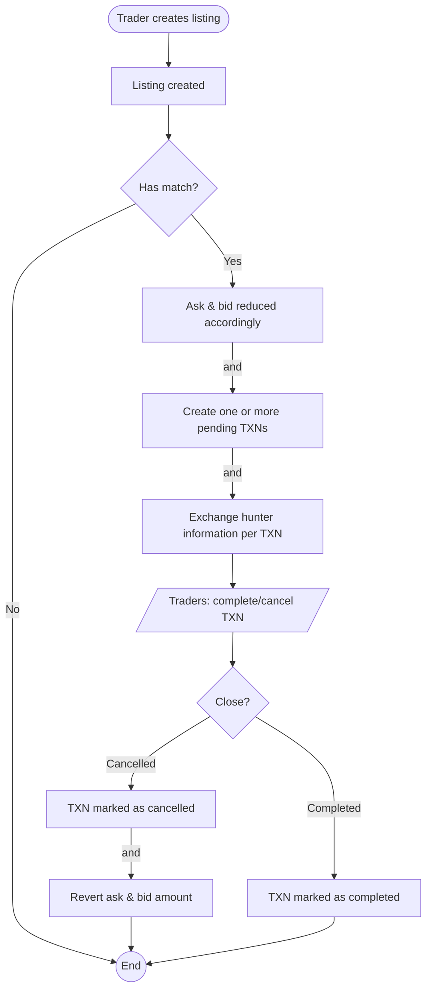
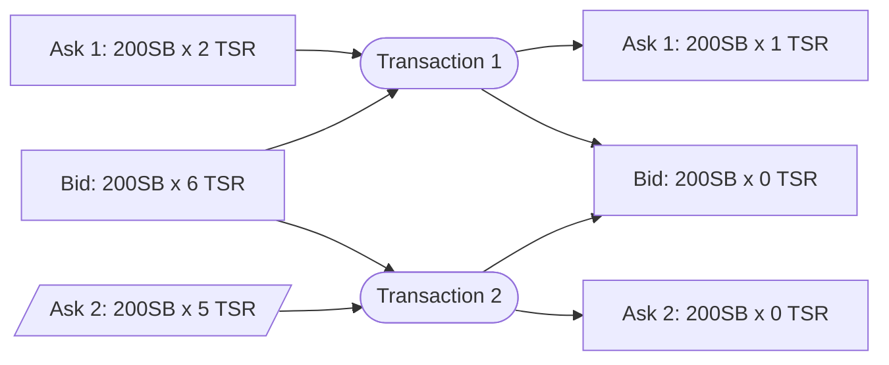

# Trading

## Listings

An **ask** and **buy** each require the same information:

- Amount - The quantity you want to bid/ask for
- Price - The price per batch
- Batch - The smallest amount of items allowed to be transacted

Batches are needed for scenarios where items are priced <1SB each. With batching, you can sell 2 Enerchi charms for 1 SB+ per batch.

## Transactions (TXNs)

A transaction involves a bid and ask. These listings involved can be more than one depending on the situation.

### Expiration

Transactions automatically expire 5 minutes after you've gone offline. The justification for this is that the involved parties must be active to ensure swift fulfillment.

## The transaction flow

Both flows of buy and sell are identical.

## Matching

### Partial fulfillment

Once you've created a bid, GNAWEX will attempt to look for one or more asks that match your price point and quota. It doesn't guarantee that it can fulfill your entire order; Partial orders are possible.

### Multiple TXNs

As mentioned earlier, it is also possible for GNAWEX to involve more than one listing. If your bid cannot be fulfilled by one ask listing but can be done by two, two transactions will be created.

## Terms

- Txn - Shorthand for *transaction*
- Ask - A sell listing
- Bid - A buy listing
- Transaction - When an ask and bid match, a transaction is created with these as inputs to associate these two listings, along with information such as amount involved.

