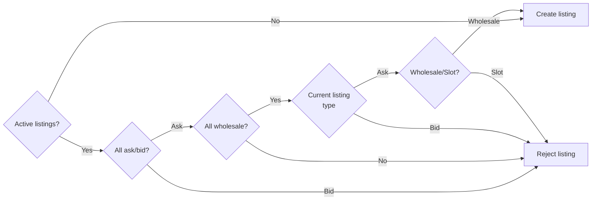

# Maps

Similar with items, except they have more restrictions and some different
fields.

## Validation Flow

These are the conditions when creating a map listing.

> TODO: Update flowchart to accommodate multiple per slot bid listings.

Due to how maps were designed, there are some things you cannot do.

You cannot:

- Ask/bid more slots than what the map has.
- Have more than 1 listing of a map unless you're **selling** wholesale for each
listing. So if you have an existing listing that's sold per slot, you cannot
create any more map listings.
- Have someone else send the map invite, or have someone else join in someone's
behalf.

You can:

- Sell as much maps as you're able if you make each listing wholesale. The
moment you have one active listing that's per slot, you can't.

## Two kinds of map listings

### Wholesale

#### Ask

- Map
- Amount - # of map scrolls
- Price - Cost per scroll

#### Bid

With wholesale bids, you're restricted to one active at a time. You're able to
create a new one once it's closed.

- Map
- Price - Cost

### Per slot

#### Ask

- Map
- Slots - Number of available slots
- [RMD](## "Rare map dust") discount - If one is willing to dust as a
bidder/leecher. This would depend on how much the median market value of RMD is.
- Price - Cost per slot

#### Bid

Unlike wholesale bids, you can have multiple active per slot bids at the same
time. However, once one gets matched, all the other listings get delisted until
the transaction is complete.

- Map
- Price - Slot cost
- (If it's not a dusted map) Avail RMD discount

<<<<<<< Updated upstream
If you want to have people join for free then you're able to price it at 0 SB+
instead. Other arrangements like discount if you help catch some mice can be
done outside GNAWEX.

**Leechers and snipers**

Leechers and snipers are only available for per slot bid listings. You can
specify how many slots for leechers, and snipers you would like to offer.

> TODO: Add a flowchart for sellers involving leechers and snipers.

1. You have to specify the mice/items in the map, which of them are uncaught,
and which you would like to have sniped.
2. You cannot create a listing if you have more than 1 uncaught mouse/item, and
if you aren't offering that to be sniped.
3. You can only disable a mouse/item that was up for grabs if the sniper
completes the transaction successfully.
4. Leecher slots are only enabled when there's only 1 uncaught mouse/item left.
