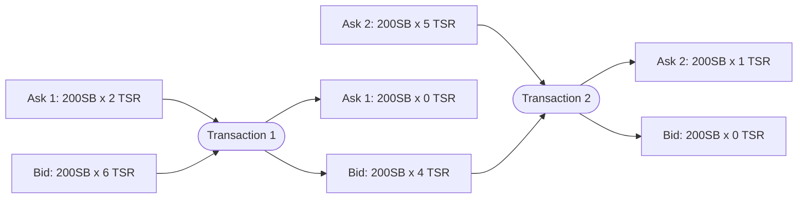

# Matching

## Partial fulfillment

Once you've created a bid, GNAWEX will attempt to look for one or more asks that
match your price point and quota. It doesn't guarantee that it can fulfill your
entire order; Partial orders are possible.

## Multiple TXNs

As mentioned earlier, it is also possible for GNAWEX to involve more than one
listing. If your bid cannot be fulfilled by one ask listing but can be done by
two, two transactions will be created.

