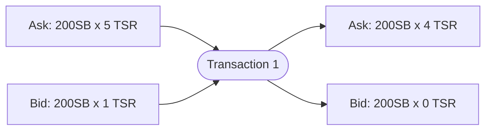
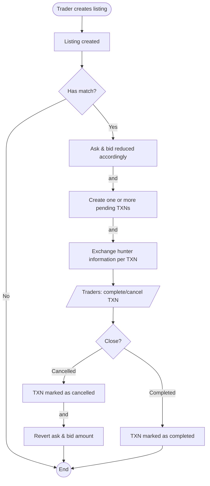

# Transactions (TXNs)

A **transaction** involves a bid and ask. These listings involved can be more
than one depending on the situation.

> **Note:** The transaction flow is identical with items, maps, and bounties.
> The only difference is the data needed.

> **Note:** The transaction flow is identical with items, maps, and bounties. The only difference is the data needed.

## The transaction flow

Both flows of buy and sell are identical.

